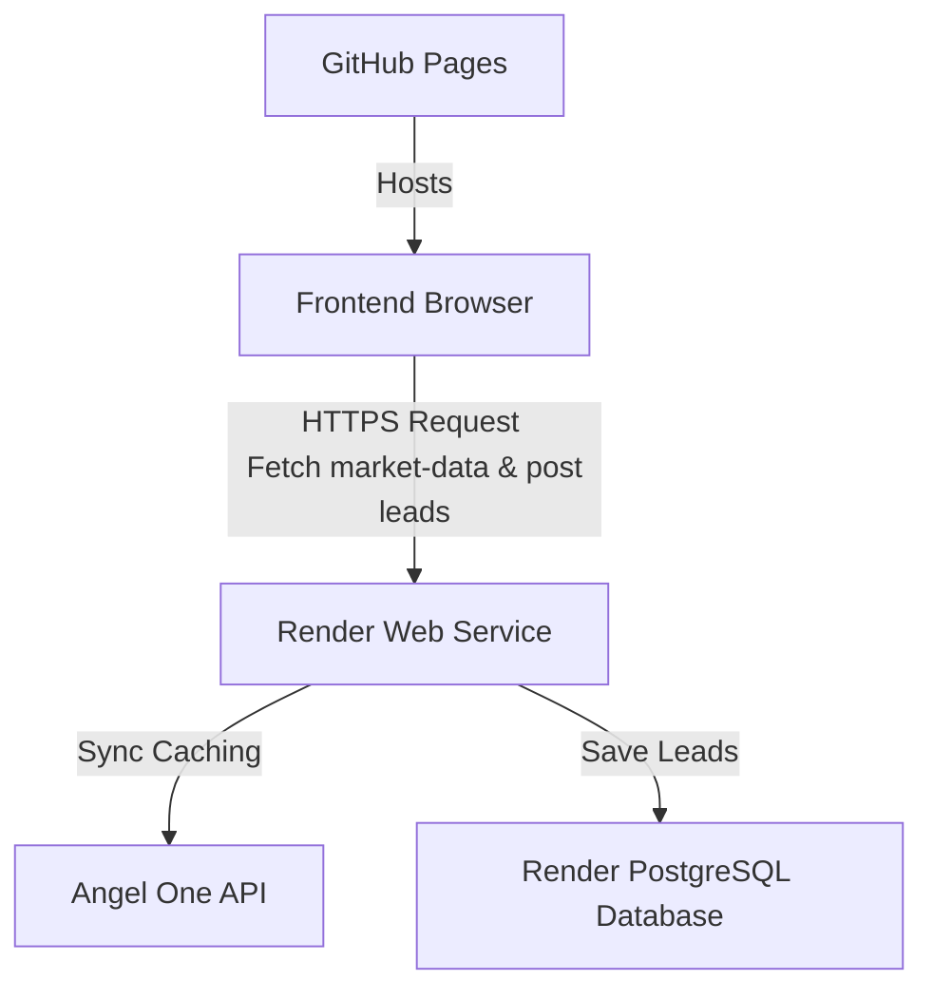

# Production Deployment Guide: NoorDhan Investments

This document describes how to deploy the NoorDhan Investments application to production.

## Architecture Overview



---

## Part 1: Database & Backend Deployment (Render)

Render supports automated environment setup using the blueprint specification (`render.yaml`) included at the root of this repository.

### Setup Instructions

1. **Log in to Render**: Go to [Render Dashboard](https://dashboard.render.com/).
2. **Deploy Blueprint**:
   * Click **New** > **Blueprint**.
   * Connect your GitHub repository (`atherunofficial-dotcom/NoorDhan-INVESTMENTS`).
   * Render will detect the `render.yaml` file and prompt you to create the services:
     * Database: `noordhan-db` (PostgreSQL)
     * Web Service: `noordhan-backend` (Node.js API)
3. **Fill in Environment Variables**:
   * Provide values for the following keys in the blueprint setup console (do not check these into version control):
     * `ANGEL_API_KEY`: Your Angel One developer Key
     * `ANGEL_CLIENT_CODE`: Your Angel One Client Code
     * `ANGEL_PASSWORD`: Your 4-digit PIN password
     * `ANGEL_TOTP`: Your 2FA TOTP secret key (Base32 encoded)
4. **Deploy**: Confirm the configuration. Render will automatically provision the PostgreSQL database, link the connection string (`DATABASE_URL`) to your backend web service, run `npm install`, start `node server.js`, and verify the health check endpoint `/health`.

---

## Part 2: Frontend Deployment (GitHub Pages)

The frontend is a static landing page. GitHub Pages is used to host it for free.

### Setup Instructions

1. **Verify Root Entrypoint**:
   Ensure `index.html` exists in the root of your GitHub repository. (This has been prepared automatically as a replica of `noordhan-investments.html`).
2. **Push to GitHub**:
   Commit and push your files to your GitHub repository:
   ```bash
   git add .
   git commit -m "Configure production database and GitHub Pages deployment entrypoint"
   git push origin master
   ```
3. **Enable GitHub Pages**:
   * Go to your repository settings on GitHub (`https://github.com/atherunofficial-dotcom/NoorDhan-INVESTMENTS/settings`).
   * In the left sidebar, click **Pages**.
   * Under **Build and deployment**, select **Deploy from a branch**.
   * Select your branch (e.g. `master` or `main`) and folder (`/ (root)`).
   * Click **Save**.
4. **Visit Frontend URL**:
   Your site will be live at `https://atherunofficial-dotcom.github.io/NoorDhan-INVESTMENTS/` within a few minutes.

---

## Troubleshooting Guide

### 1. Mixed Content Error
* **Symptom**: Console logs show `Blocked loading mixed active content...`.
* **Fix**: Ensure the frontend is calling `https://noordhan-backend.onrender.com` (HTTPS) rather than `http://` or `localhost`. This is automated dynamically in our `index.html` URL resolver.

### 2. Invalid Token / Angel One Login Fails
* **Symptom**: Backend console logs: `❌ Angel One Rejected Login`.
* **Fix**: Ensure the `ANGEL_TOTP` secret is correctly copied (in uppercase, no spaces) from your Angel One SmartAPI console. Ensure the backend server clock is synchronized, as TOTP codes are time-sensitive.

### 3. PostgreSQL Database Connection Timeout
* **Symptom**: Health checks fail and the logs say `connection timeout` or `self-signed certificate in certificate chain`.
* **Fix**: Render PostgreSQL requires SSL connection options. Our `server.js` is pre-configured with `ssl: { rejectUnauthorized: false }` to bypass verification of self-signed server certificates on Render.
